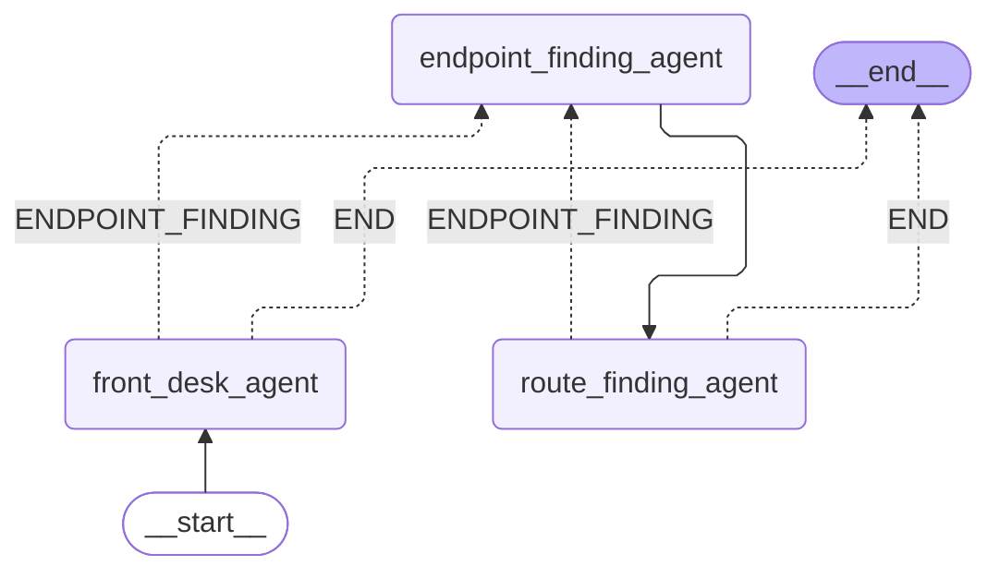

# A Starter Multi-Agent System

This directory contains a starter project for building agents with Couchbase, LangGraph, and Agent Catalog.

## A 3-Agent System

_We assume some familiarity with the
[Travel Sample Data Model](https://docs.couchbase.com/python-sdk/current/ref/travel-app-data-model.html) and the core
concepts of [LangGraph](https://langchain-ai.github.io/langgraph/)._

This starter project is meant to get new users familiar with the processes of building agents in a _principled_ manner.
In this project, there are three agents:

1. "Front Desk" -- Purposed to interact with the user and the "Endpoint Finding" agent.
2. "Endpoint Finding" -- Purposed to translate the user's input into IATA airport codes and interact with the
   "Route Finding" agent.
3. "Route Finding" -- Purposed to find routes using Couchbase tools between the endpoints provided by the
   "Endpoint Finding" and to i) interact with the "Endpoint Finding" agent to provide new endpoints if no routes are
   found or ii) send the routes (or lack of routes) to the "Front Desk" agent to give back to the user.



Note that this example is slightly different from the `with_langgraph` example -- user interaction is handled outside
the graph (instead of using a `talk_to_user` tool)!
This project extends our `with_langgraph` example to handle multiple users with multiple sessions and places our
multi-agent system behind FastAPI.
This project additionally illustrates how to realize streaming (for more interactive apps) and how to leverage LangGraph
checkpoints with Couchbase to separate storage and compute (enabling scale-out).

## Getting Started

### Installing Agent Catalog

1. Make sure you have Python 3.12 and [Poetry](https://python-poetry.org/docs/#installation) installed!
2. Clone this repository and navigate to this directory (we will assume all subsequent commands are run from here).

   ```bash
   git clone https://github.com/couchbaselabs/agent-catalog
   cd examples/with_fastapi
   ```

3. Agent Catalog uses Git for its versioning.

   Run the command below to initialize a new Git repository within the `examples/with_fastapi` directory.

   ```bash
   git init
   ```

4. Install this example using Poetry.
   By default, Poetry will create a new virtual environment to hold this project.
   ```bash
   poetry install
   ```

5. Activate your newly created virtual environment.
   **You must be in this virtual environment for all subsequent commands to properly execute!**

   ```bash
   poetry shell
   ```

   In your shell, you should now see something similar below if you run `which python`:
   ```bash
   which python
   > /Users/$USER/Library/Caches/pypoetry/virtualenvs/with-fastapi-example-gJ1RHvkw-py3.12/bin/python
   ```

6. Run `agentc` to make sure this project has installed correctly (note that your first run will take a couple of
   seconds as certain packages need to be compiled, subsequent runs will be faster).

   ```bash
   Usage: agentc [OPTIONS] COMMAND [ARGS]...

     The Couchbase Agent Catalog command line tool.

   Options:
     -c, --catalog DIRECTORY         Directory of the local catalog files.  [default: .agent-catalog]
     -a, --activity DIRECTORY        Directory of the local activity files (runtime data).  [default: .agent-activity]
     -v, --verbose                   Flag to enable verbose output.  [default: 0; 0<=x<=2]
     -i, --interactive / -ni, --no-interactive
                                     Flag to enable interactive mode.  [default: i]
     --help                          Show this message and exit.

   Commands:
     add      Interactively create a new tool or prompt and save it to the filesystem (output).
     clean    Delete all agent catalog related files / collections.
     env      Return all agentc related environment and configuration parameters as a JSON object.
     execute  Search and execute a specific tool.
     find     Find items from the catalog based on a natural language QUERY string or by name.
     index    Walk the source directory trees (SOURCE_DIRS) to index source files into the local catalog.
     publish  Upload the local catalog to a Couchbase instance.
     status   Show the status of the local catalog.
     version  Show the current version of agentc.

     See: https://docs.couchbase.com or https://couchbaselabs.github.io/agent-catalog/index.html# for more information.
   ```

### Running Your Agent System

1. Create a `.env` file from the `.env.example` file and tweak this to your environment.

   ```bash
   cp .env.example .env
   vi .env
   ```

   If you are using Capella, you'll need to download a security certificate and set the
   `AGENT_CATALOG_CONN_ROOT_CERTIFICATE` and `CB_CERTIFICATE` variables appropriately.

2. Start up a Couchbase instance.

   - For those interested in using a local Couchbase instance, see
     [here](https://docs.couchbase.com/server/current/install/install-intro.html).

   - For those interested in using Couchbase within a Docker container, run the command below:

       ```bash
       mkdir -p .data/couchbase
       docker run -d --name my_couchbase \
         -p 8091-8096:8091-8096 -p 11210-11211:11210-11211 \
         -v "$(pwd)/.data/couchbase:/opt/couchbase/var" \
         couchbase
       ```

   - For those interested in using Capella, see [here](https://cloud.couchbase.com/sign-up).

   Once your Couchbase instance is running, be sure to enable the following services on your Couchbase cluster:
   i) Data, ii) Query, iii) Index, iv) Search, and v) Analytics.

   This specific agent also uses the `travel-sample` bucket.
   You'll need to navigate to your instance's UI (for local instances, this is on http://localhost:8091) to install
   this sample bucket.

3. Initialize your local and Couchbase-hosted Agent Catalog instance by running the `agentc init` command.
   In this example, we will also add a post-commit hook to integrate `agentc` with your existing `git` workflow.

   ```bash
   agentc init --add-hook-for tools --add-hook-for prompts
   ```

4. Now let us make our first commit, which will use `agentc` behind the scenes.

   ```bash
   git add * ; git add .gitignore .env.example .pre-commit-config.yaml
   git commit -m "Initial commit"
   ```

   _Hint: if you've made changes but want to keep the "same" commit within your local branch, use
   `git add $MY_FILES` followed by `git commit --amend`!_

5. Run your agent system using FastAPI with 8 workers.

   ```bash
   fastapi run server.py --workers 8
   ```

6. Interact with your agent system using CURL (you will have to run this in a separate shell).

   ```bash
   curl --no-buffer -X 'POST' \
     'http://localhost:8000/chat' \
     -H 'accept: application/json' \
     -H 'Content-Type: application/json' \
     -d '{
     "session_id": "<AUTOGENERATE ME IN YOUR APP>",
     "user_id": "Glenn",
     "message": "i need to go to LAX from SFO",
     "include_intermediate": true
   }'
   ```

   You should see events emitted as your agent system runs your query:

   ```markdown
   **Reasoning**: We do not need clarification from the user.

   **Reasoning**: Endpoints have been identified as {'source': 'SFO', 'destination': 'LAX'}.

   **Tool**: The following routes have been found: [{'source': 'SFO', 'dest': 'LAX'}, {'source': 'SFO', 'dest': 'LAX'},
   {'source': 'SFO', 'dest': 'LAX'}, {'source': 'SFO', 'dest': 'LAX'}, {'source': 'SFO', 'dest': 'LAX'},
   {'source': 'SFO', 'dest': 'LAX'}, {'source': 'SFO', 'dest': 'LAX'}].

   **Assistant Response**:
   I found several direct flight options from San Francisco International Airport (SFO) to Los Angeles International
   Airport (LAX). Here are the airlines that operate direct flights:

   1. Alaska Airlines (AS)
   2. Delta Airlines (DL)
   3. United Airlines (UA)
   4. US Airways (US)
   5. Virgin America (VX)
   6. Southwest Airlines (WN)
   7. American Airlines (AA)

   If you need more details about flight times or prices, please let me know!
   ```