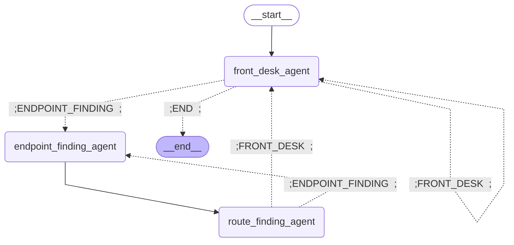

# A Starter Multi-Agent System

This directory contains a starter project for building agents with Couchbase, LangGraph, and Agent Catalog.

## A 3-Agent System

_We assume some familiarity with the
[Travel Sample Data Model](https://docs.couchbase.com/python-sdk/current/ref/travel-app-data-model.html) and the core
concepts of [LangGraph](https://langchain-ai.github.io/langgraph/)._

This starter project is meant to get new users familiar with the processes of building agents in a _principled_ manner.
In this project, there are three agents:

1. "Front Desk" -- Purposed to interact with the user and the "Endpoint Finding" agent.
2. "Endpoint Finding" -- Purposed to translate the user's input into IATA airport codes and interact with the
   "Route Finding" agent.
3. "Route Finding" -- Purposed to find routes using Couchbase tools between the endpoints provided by the
   "Endpoint Finding" and to i) interact with the "Endpoint Finding" agent to provide new endpoints if no routes are
   found or ii) send the routes (or lack of routes) to the "Front Desk" agent to give back to the user.



## Getting Started

### Installing Agent Catalog

1. Make sure you have Python 3.12 and [Poetry](https://python-poetry.org/docs/#installation) installed!
2. Clone this repository and navigate to this directory (we will assume all subsequent commands are run from here).

   ```bash
   git clone https://github.com/couchbaselabs/agent-catalog
   cd examples/with_langgraph
   ```

3. Agent Catalog uses Git for its versioning.

   Run the command below to initialize a new Git repository within the `examples/with_langgraph` directory.

   ```bash
   git init
   git add * ; git add .gitignore .env.example .pre-commit-config.yaml
   git commit -m "Initial commit"
   ```

4. Install this example using Poetry.
   By default, Poetry will create a new virtual environment to hold this project.
   ```bash
   poetry install --with analysis
   ```

5. Activate your newly created virtual environment.
   **You must be in this virtual environment for all subsequent commands to properly execute!**

   ```bash
   poetry shell
   ```

   In your shell, you should now see something similar below if you run `which python`:
   ```bash
   which python
   > /Users/$USER/Library/Caches/pypoetry/virtualenvs/my-agent-system-gJ1RHvkw-py3.12/bin/python
   ```

6. Run `agentc` to make sure this project has installed correctly (note that your first run will take a couple of
   seconds as certain packages need to be compiled, subsequent runs will be faster).

   ```bash
   Usage: agentc [OPTIONS] COMMAND [ARGS]...

     The Couchbase Agent Catalog command line tool.

   Options:
     -c, --catalog DIRECTORY         Directory of the local catalog files.  [default: .agent-catalog]
     -a, --activity DIRECTORY        Directory of the local activity files (runtime data).  [default: .agent-activity]
     -v, --verbose                   Flag to enable verbose output.  [default: 0; 0<=x<=2]
     -i, --interactive / -ni, --no-interactive
                                     Flag to enable interactive mode.  [default: i]
     --help                          Show this message and exit.

   Commands:
     add      Interactively create a new tool or prompt and save it to the filesystem (output).
     clean    Delete all agent catalog related files / collections.
     env      Return all agentc related environment and configuration parameters as a JSON object.
     execute  Search and execute a specific tool.
     find     Find items from the catalog based on a natural language QUERY string or by name.
     index    Walk the source directory trees (SOURCE_DIRS) to index source files into the local catalog.
     publish  Upload the local catalog to a Couchbase instance.
     status   Show the status of the local catalog.
     version  Show the current version of agentc.

     See: https://docs.couchbase.com or https://couchbaselabs.github.io/agent-catalog/index.html# for more information.
   ```

### Running Your Agent System

1. Create a `.env` file from the `.env.example` file and tweak this to your environment.

   ```bash
   cp .env.example .env
   vi .env
   ```

   If you are using Capella, you'll need to download a security certificate and set the
   `AGENT_CATALOG_CONN_ROOT_CERTIFICATE` and `CB_CERTIFICATE` variables appropriately.

2. Start up a Couchbase instance.

   - For those interested in using a local Couchbase instance, see
     [here](https://docs.couchbase.com/server/current/install/install-intro.html).

   - For those interested in using Couchbase within a Docker container, run the command below:

       ```bash
       mkdir -p .data/couchbase
       docker run -d --name my_couchbase \
         -p 8091-8096:8091-8096 -p 11210-11211:11210-11211 \
         -v "$(pwd)/.data/couchbase:/opt/couchbase/var" \
         couchbase
       ```

   - For those interested in using Capella, see [here](https://cloud.couchbase.com/sign-up).

     Once your Couchbase instance is running, be sure to enable the following services on your Couchbase cluster:
     i) Data, ii) Query, iii) Index, iv) Search, and v) Analytics.

     This specific agent also uses the `travel-sample` bucket.
     You'll need to navigate to your instance's UI (for local instances, this is on http://localhost:8091) to install
     this sample bucket.

3. Initialize your local and Couchbase-hosted Agent Catalog instance by running the `agentc init` command.

   ```bash
   agentc init
   ```

4. Make sure your Git repo is clean, and run `agentc index` to index your tools and prompts.

   ```bash
   # agentc index
   agentc index .
   ```

   This command will subsequently crawl the current working directory for both tool and prompt files.

   _Hint: if you've made changes but want to keep the "same" commit within your local branch, use
   `git add $MY_FILES` followed by `git commit --amend`!_

5. Publish your local agent catalog to your Couchbase instance with `agentc publish`.
   Your Couchbase instance details in the `.env` file will be used for authentication.
   Again, this specific starter agent system uses the `travel-sample` bucket.

   ```bash
   agentc publish
   ```

   _Hint: feel free to install `agentc` as a post-commit hook!
   Run `pre-commit install --hook-type post-commit --hook-type pre-commit` to install this project's (pre|post)-commit
   hooks and run `agentc index` + `agentc publish` after `git commit [--amend]`!_

6. Finally, run your agent system and talk with the "Front Desk" agent!

   ```bash
   python main.py
   ```

### (Ad-Hoc) Tuning Your Agent System

In this section, we will illustrate how you can "tune" your agent system in an ad-hoc (but provenance-capturing) manner.

1. To start, let's find a route from SFO to LAX.

    ```text
    > Assistant: Please provide the source and destination airports.
    > User: I want to go to LA. I am in the north bay area.
    > Assistant: Here are the direct flight options from the North Bay Area to Los Angeles:
      **From Charles M. Schulz–Sonoma County Airport (STS) to Los Angeles International Airport (LAX):**
      - Alaska Airlines (AS)
      - American Airlines (AA)

      **From San Francisco International Airport (SFO) to Los Angeles International Airport (LAX):**
      - Alaska Airlines (AS)
      - Delta Airlines (DL)
      - United Airlines (UA)
      - US Airways (US)
      - Virgin America (VX)
      - Southwest Airlines (WN)
      - American Airlines (AA)

      **From Oakland International Airport (OAK) to Los Angeles International Airport (LAX):**
      - Delta Airlines (DL)
      - AirTran Airways (FL)
      - Southwest Airlines (WN)

      You have several options to choose from, depending on your preferred airport and airline. Let me know if you
      need further assistance with booking or additional information!
    > User: That's all, thanks
    > Assistant: You're welcome! If you have any more questions in the future, feel free to ask. Have a great trip
      to LA!
    ```

2. Next, let's try a set of endpoints that has requires one layover.
   Specifically, we want a route from Canyonlands Field Airport (IATA 'CNY') to LAX.

   ```text
   > Assistant: Please provide the source and destination airports.
   > User: i want to go to LAX from Canyonlands Field Airport
   > Assistant: To travel from Canyonlands Field Airport (CNY) to Los Angeles International Airport (LAX), you will
     likely need to book a connecting flight, as there may not be direct flights available. You can check with airlines
     that operate from CNY for available routes and connections. Additionally, consider checking travel websites or
     consulting with a travel agent to find the best options for your trip.
   ```

   This is **not** a correct response -- and the culprit lies with our "Front Desk" agent incorrectly assuming the
   user input is not relevant to route planning.

   1. To fix this, let us modify our prompt.
      Open the file `prompts/front_desk.yaml` and uncomment the item at the very bottom of the
      `content --> agent_instructions` list:

      ```yaml
         - >
           If the user asks for flights / routes from obscure or small airports, DO NOT assume that no routes exist.
           Let another agent decide this, not you.
           In this case, set the is_last_step to False.
      ```

   2. Next, we will create a new commit that captures this change.

      ```bash
      git add prompts/front_desk.yaml ; git commit -m "Fixing front desk agent."
      ```

   3. If you ran `pre-commit install --hook-type post-commit` earlier, `agentc index` + `agentc publish` will have
      automatically run.
      Otherwise, run these commands here.

      ```bash
      agentc index prompts
      agentc publish
      ```

   4. Now, let us try the same input again with our agent system.

       ```text
       > Assistant: Please provide the source and destination airports.
       > User: i want to go to LAX from Canyonlands Field Airport
       > Assistant: There are no direct flights from Canyonlands Field Airport (CNY) to Los Angeles International
      Airport (LAX). However, there are several one-layover flights available with a stop in Salt Lake City (SLC).
      Here are the options:

       1. **Delta Airlines (DL) to Alaska Airlines (AS)** with a layover in SLC.
       2. **Delta Airlines (DL) to Delta Airlines (DL)** with a layover in SLC.
       3. **Delta Airlines (DL) to KLM (KL)** with a layover in SLC.
       4. **Delta Airlines (DL) to United Airlines (UA)** with a layover in SLC.
       5. **Delta Airlines (DL) to US Airways (US)** with a layover in SLC.
       6. **Delta Airlines (DL) to Southwest Airlines (WN)** with a layover in SLC.
       7. **Delta Airlines (DL) to American Airlines (AA)** with a layover in SLC.

       You can choose any of these options based on your preference for airlines and schedule.
       > User: that's all, thanks
       > Assistant: You're welcome! If you have any more questions in the future, feel free to reach out. Safe travels!
       ```

      ...and it seems our fix has worked!

### Evaluating Your Agent System

In this section, we will now illustrate some building blocks for authoring your own set of evaluations.
_We assume that the previous section has not been run (i.e., the "i want to go to LAX from Canyonlands Field Airport"
input is not working)._

1. Enter the command below to execute two prebuilt evaluation suites (`eval_bad_intro` and `eval_short_threads`)
   three separate times.

   ```bash
   for i in {1..3}; do pytest evals -v; done
   ```

   *Get some coffee, this will take some time!*
   Once this command is run, you should see logs generated by these evaluations in your `.agent-activity` folder and
   `agent_activity.logs` collection with `span.name` values starting with either `"IrrelevantGreetings"` or
   `"ShortThreads"` followed by `"Eval_[0-9]"`  **but** with the same subsequent name parts used in the rest of our
   application (e.g., `"flight_planner"`, `"front_desk_node"`).

2. Next, let's take a closer look at the file `evals/eval_short.py`.
   This sample application has two "eval" functions: one to make sure that our agent application does not respond to
   irrelevant greetings and another to make sure that our agent application responds "correctly" to short 1-2 turn
   conversations.

   1. To evaluate irrelevant greetings, we stop at the first response given by our application.
      If our application has not correctly determined that the conversation needs to end, then we use the `[]` operator
      on our span to record this (as `correctly_set_is_last_step`).
   2. To evaluate whether (or not) our application has correctly answered a user's request, we use Ragas's
      "simple criteria score" to use an LLM (in our case, `gpt-4o`, to return a number between 0 and 5 based on the
      similarity of answers (i.e., "references").

3. Now let's take a closer look at these logs on Couchbase.
   Log onto your Couchbase instance and let's write two queries for the evaluations we just ran (in this example,
   we'll use the Analytics Service):
   *We assume some familiarity with SQL++ here.*

   1. First, does our agent reliably feign off bad introductions?
      Specifically, what is the percentage of instances that our agent properly handles an irrelevant introduction?

      ```sql
         WITH
            irrelevant_greetings AS (
                FROM
                    `travel-sample`.agent_activity.logs AS l
                WHERE
                     l.content.kind = "key-value" AND
                     l.content.`key` = "correctly_set_is_last_step" AND
                     "IrrelevantGreetings" IN l.span.name
                SELECT VALUE l.content.`value`
            ),
            correct_runs AS ( FROM irrelevant_greetings AS ig WHERE ig SELECT VALUE COUNT(*) )[0],
            incorrect_runs AS ( FROM irrelevant_greetings AS ig WHERE NOT ig SELECT VALUE COUNT(*) )[0]
         SELECT VALUE
            correct_runs / incorrect_runs;
      ```

      For my runs I see a 50% success rate, suggesting that our front desk agent needs to be modified to properly
      recognize irrelevant greetings (some ideas here include reducing the surface area of user input through more
      restrictive UI or more intelligent intent recognition).

   2. Next, what is the average "goal accuracy" of our latest application version?

      ```sql
         WITH latest_catalog_version AS (
            FROM
                `travel-sample`.agent_catalog.metadata AS m
            SELECT VALUE
                m.version.identifier
            ORDER BY
                STR_TO_MILLIS(m.version.timestamp) DESC
         )[0]
         FROM
            `travel-sample`.agent_activity.logs AS l
         WHERE
            l.content.kind = "key-value" AND
            l.content.`key` = "goal_accuracy" AND
            l.catalog_version.identifier = latest_catalog_version
         SELECT VALUE
            AVG(l.content.`value`.score);
      ```

      For my runs I get an average score of 1.44 with one of the "problematic" inputs being the
      "Canyonlands Field Airport CNY" input.
      If we make the same change as we did in the previous section (the change to `prompts/front_desk.yaml`), we see
      and run the query below, we should see an improvement in our goal accuracy:

      ```sql
         FROM
            `travel-sample`.agent_activity.logs AS l
         WHERE
            l.content.kind = "key-value" AND
            l.content.`key` = "goal_accuracy"
         GROUP BY
             l.catalog_version
         SELECT
            AVG(l.content.`value`.score),
            l.catalog_version
         ORDER BY
            l.catalog_version.timestamp DESC;
      ```

      TODO (tweak the scorer)
